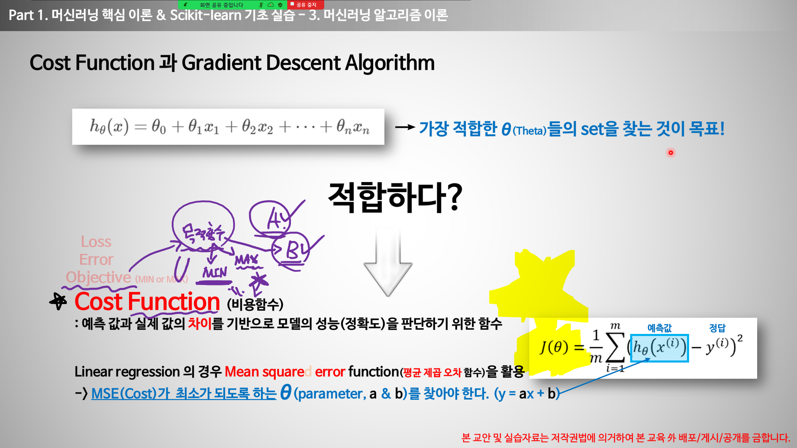
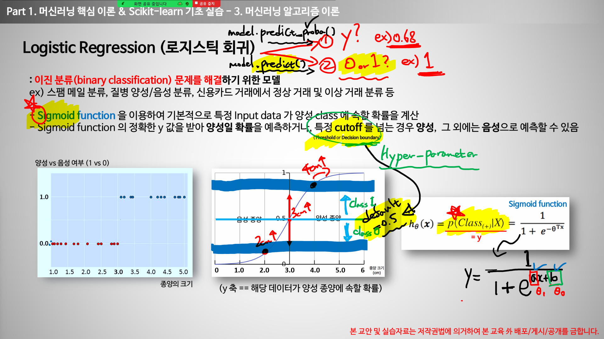
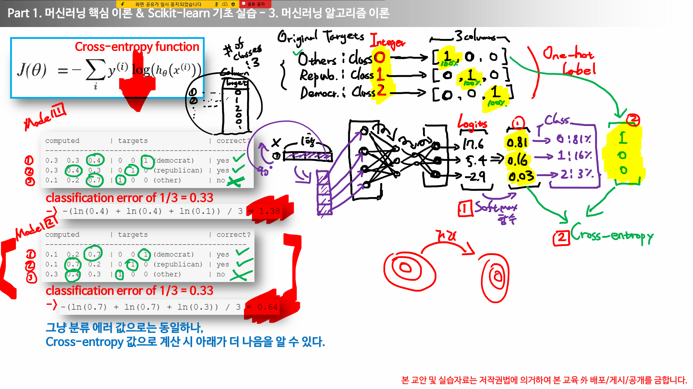

## 1. Linear Regression (선형회귀)
    - 종속 변수 y와 한개 이상의 독립변수(설명변수) x 사이의 선형 상관 관계를 모델링하는 회귀분석 기법

- 1개의 독립변수(x)가 1개의 종속변수(y)에 영향을 미칠 때 : 단순 회귀분석
- 2개 이상의 독립변수(x)가 1개의 종속변수(y)에 영향을 미칠때 : 다중 회귀분석

선형회귀식 : 선형결합이라고도 부름(Linear Combination)

Cost Function(비용함수/에러함수) (=Loss Function / Error Function) (cost = 에러)
1. 평균제곱오차함수(Mean Squared Error Function) -> MSE(회귀분석에서 가장 대표격인 cost function)
2. MAE(절대값)
3. MAPE(Persentage)
4. RMSE(Root)

MSE 
- x값을 넣어서 예측한 y값과 실제 y값(정답)과의 오차를 다 더한뒤 제곱하고, 갯수로 나눈 값이 0이 되려면, 오차가 모두 0이어야 함(제곱값은 양수이기 때문에 분자값이 0이 되려면 오차가 0이 될수밖에 없음) -> 해당 값이 낮으면 낮을수록(좋음) 계수값(가중치=weight)과 상수값(편향=bias)을 적절히 찾을 수 있다.

- cost function을 제이함수로 많이 표현한다.

<!-- - 세타가 바뀜에 따라 mse값이 바뀌고 이러한 점을 연결하면 곡선이 - 만들어질수도 있다.  -->
- 세타 1개의 값에 mse 1개의 값이 결정되므로 이러한 점을 연결하면 곡선이 만들어질수도 있다.
- mse가 최소가 되는 세타원값은, repeat until convergence를 통해 도달할 수 있다.그 지점을 Global Minimum(전역최소값)이라 한다.

제이세타 -> MSE

알파는 무엇이냐? -> Learning Rate(학습률)이다. (=보폭) / 우리가 결정한다. 보통 0.01 or 0.001로 설정한다.
: 얼마나 큰 보폭으로 움직일지 결정해주는 값

Learning Rate와 같이 사람이 결정하는 모든 것들 -> Hyper-Parameter(초매개변수)이라 한다.
컴퓨터가 결정하는 것 -> Parameter theta

* Hyper-Parameter Optimization(=HPO) 
   :사람이 결정해야 하는 것을 제일 좋은 것으로 결정해주는것

    = Hyper Paramter Tuning
    = Model Tuning

Auto ML을 다루는 3가지 축
1. Auto Feature Engineering
2. Auto Model Selection
3. Auto HPO

그렇다면 세타제로는 언제찾나? -> 세타원 찾을때 같이진행함.

Optimization
세타의 좋은 값을 찾는 것
gradient descent(딥러닝떄 많이씀)로도 할 수 있고 미분방정식으로 구할수 있다.

----------------------------------------------------------------------

## 2. Logistic Regression (로지스틱 회귀)
      - 이전 분류 문제를 해결하기 위한 모델
      - 변형된 모델로 다항 로지스틱 회귀(k-class)와 서수 로지스틱 회귀(k-class & ordinal)도 존재

- Sigmoid function을 이용하여 기본적으로 특정 input data가 양성 class에 속할 확률을 계산한다.
- Sigmoid function의 정확한 y값을 받아 양성일 확률을 예측하거나, 특정 cutoff를 넘는 경우 양성, 그 외에는 음성으로 예측할 수 있다.

- sigmoid함수에서 a(세타원)가 바뀜에따라 완만해지거나 가팔라진다.
- b(세타제로)가 바뀜에 따라 x축 기준으로 좌우로 움직인다.
- cutott는 hyper-parameter이다.

------------------------------------------------------------------------------------

- 성능 지표로 Mean Squared Error가 아니라 분류를 위한 Cost-function인 Cross-entropy를 활용한다.(예측값의 분포와 실제값의 분포를 비교하여 그 차이를 Cost로)
분류문제는 -> cross-entropy
회귀문제는 -> mse

Softmax Algorithm(소프트맥스 알고리즘) : 다중 클래스 분류(Multi-class / Multinomial classfication)문제를 위한 알고리즘(일종의 함수)

