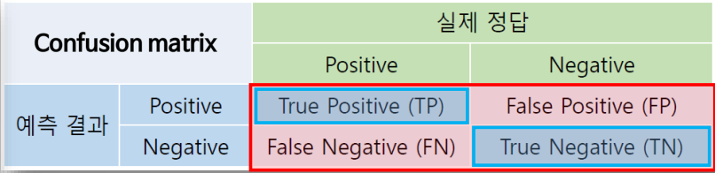
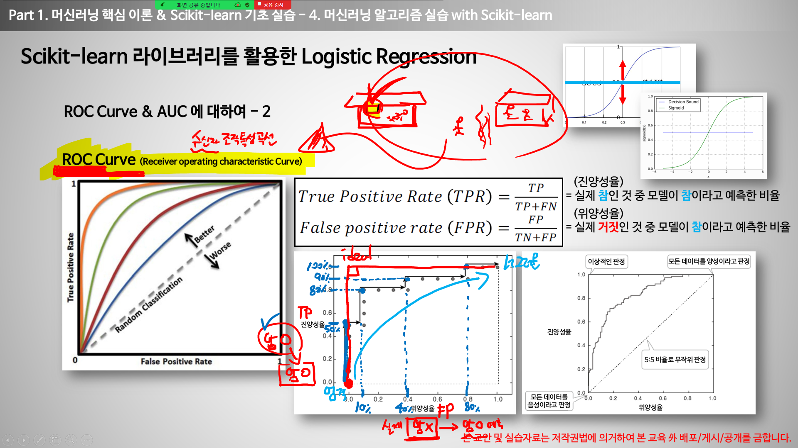
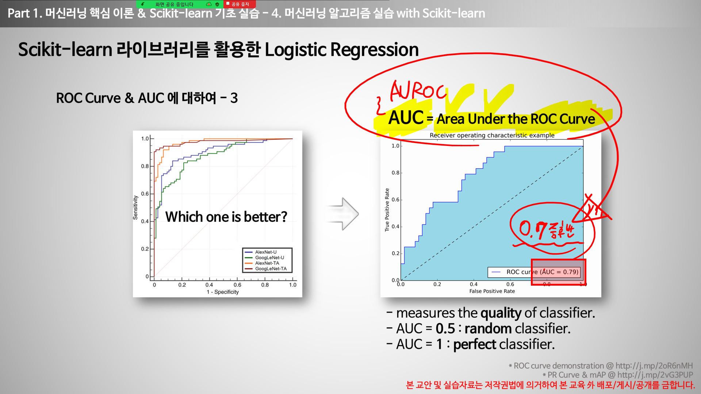
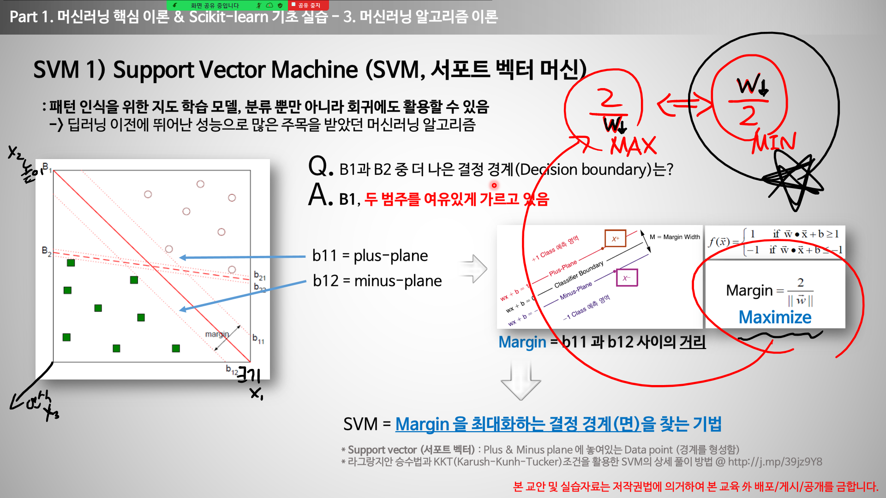
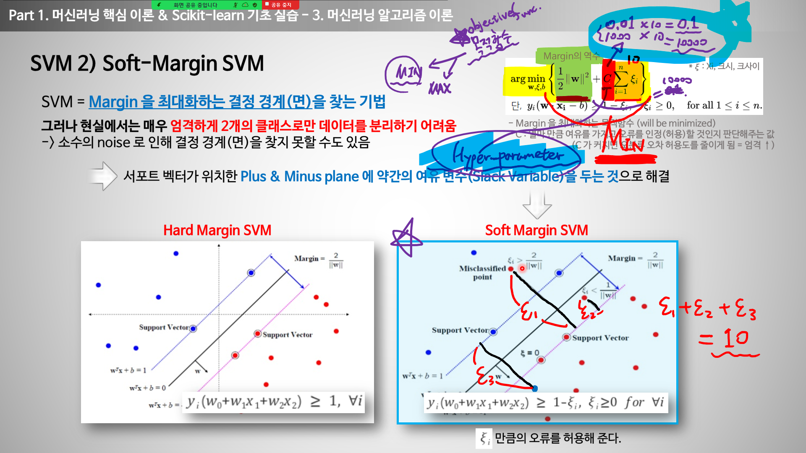
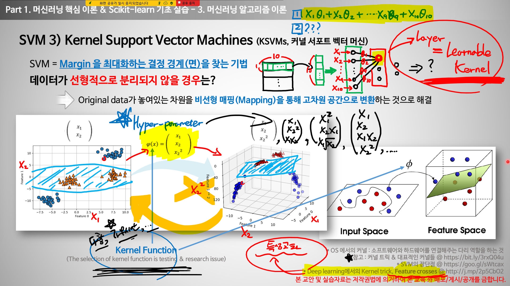
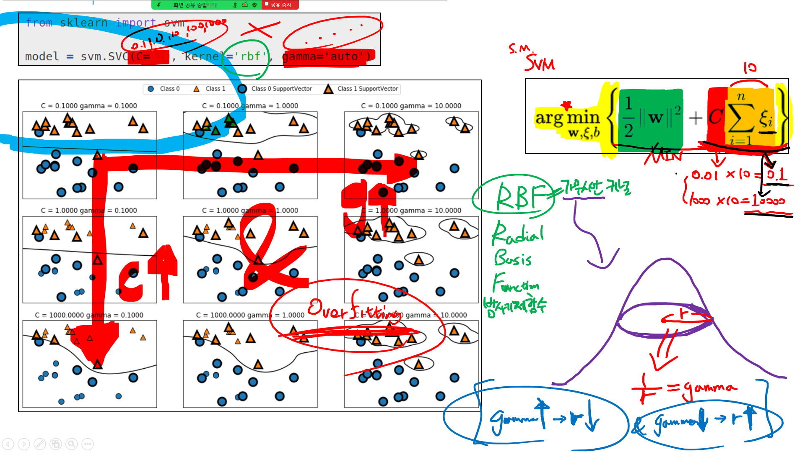

## 1. Scikit-learn 라이브러리를 활용한 Logistic Regression

이진 분류를 위한 로지스틱 회귀 & ROC Curve

* 배경: 암환자에 대한 예측상황 가정
<!-- * 앞에 있는 True/False가 예측값(암이면 Fasle, 암이 아니면 True)
* 뒤에 있는 Positive/Negative가 실제값(암이라고 예측했으면, Negative, 암이 아니라고 예측했으면 Positive) -->
1. True Positive(TP) : 암이 아니라고 예측했는데, 실제로도 암이 아닌 경우
2. False Positive(FP) : 암이 아니라고 예측했는데 실제로는 암인 경우
3. False Negative(FN) : 암이라고 예측했는데, 실제로는 암이 아닌 경우
4. True Negative(TN) :  암이라고 예측했는데, 실제로도 암인 경우
 

1. 그래프에서 x축이 위양성율이고 y축이 진양성률이다.
2. 위양성률의 정의가 실제로는 거짓인데 참이라고 잘못 예측한 확률이므로, 이 확률이 낮을수록 오류가 낮음을 의미한다. 다시 말하면 x축의 값이 작을수록 모델의 성능이 좋다고 말할 수 있다.
3. 진양성률의 정의는 실제로도 참이고 예측도 참이라고 예측한 확률이므로, 이 확률이 높을수록 좋은 것이다. 다시 말하면 y값이 높을수록 모델의 성능이 좋다고 말할 수 있다.
4. 정리하면 2번과 3번의 내용으로 x축의 값은 작으면서 y축의 값은 높은 점을 찍어서 연결하면 직각의 형태인 그래프가 형성된다. 이 직각의 그래프를 그리는 모델이 가장 성능이 좋다고 말할 수 있다. (현실에선 거의 없음.)
5. 좌측 그래프에서 주황색 그래프가 가장 성능이 좋은 모델이라고 할 수 있다. 
이것을 ROC Curve라고 함.(Receiver Operationg Characteristic Curve) (수신자조작특성곡선)

1. ROC Curve에서 그래프가 그리는 면적을 AUC라고 한다.(Area Under ROC Curve)
2. 면적이 0.7중후반이면 쓸만한 모델이라고 평가한다.
____
## 2. Support Verctor Machine(SVM, 서포트 벡터 머신)
: 패턴 인식을 위한 지도 학습 모델, 분류 뿐 아니라 회귀에도 활용가능하다.
 - -> 딥러닝 이전에 뛰어난 성능으로 많은 주목을 받았던 머신러닝 알고리즘이다.

- 서포트 벡터는 순서쌍이다.
- SVM : Margin을 최대화하는 결정 경계(면)울 찾는 기법
  
### 1. SVM 설명

1. 더 나은 결정경계를 나누는 기준은 Margin값이 최대가 되는 값이다.
2. Margin은 plus-plane과 minus-plane 두 직선의 거리를 통해서 구할 수 있다.
SVM이라는 것은 Margin을 최대화하는 결정 경계를 찾는 기법이다. 

### 2. Margin 설명

1. argmin을 사용하는 이유: margin을 설정한 범위를 벗어난 오류들을 허용(무시)해주기 위해
- C값이 작으면 무시해도 된다.
- C값이 클수록 무시할 수 없다.

2. C는 무엇이냐? -> 얼마만큼의 여유를 가지고 오류를 인정(허용)할 것인지 판단해주는 값이다.
- 오류에 대한 허용치에 반비례하는 값
- c가 클수록 오류에 대한 허용치는 작아진다.
- ex) c가 작으면 오류에 대한 허용치가 커지기 때문에 여기저기 퍼져있는 오류(크사이)를 허용할 수 있다.
- 10의 제곱수로 하는 것이 대표성을 띠기 때문에 주로 사용한다. 

### 3. 커널함수 설명

1. 데이터가 선형적으로 분리되지 않을 경우에는 어떻게 해야 하나?
   -> Kernel Function을 사용한다. (Original data)가 놓여있는 차원을 비선형 매핑을 통해 고차원 공간으로 변환하는 것으로 해결할 수 있다.
2. Kernel Function도 하이퍼 파라미터이다. 
3. 다만, 어디서부터 시작해야될지 막막하기 때문에 어느정도 성능이 나오는것을 정해놓았다. 
-> 다항커널함수, 가우시안커널함수(많이씀) 등
4. rbf : radial basis function(방사기저함수) -> 가우시안커널함수

### 4. 감마 설명

1. gamma란? -> 커널의 종류중 하나인 가우시안 커널의 분포를 평면으로 잘랐을 때 생기는 원의 반지름의 역수이다. 
2. C값이 커질수록, gamma가 커질수록 오버피팅 나기 쉽다. 
-> 왜? -> gamma가 높아질수록 원의 크기가 줄어들고, 새로운 데이터가 주어졌을 때 오버피팅을 모면할 수 없다.
3. C값도 커질수록 분류를 더 엄격하게 하고 있다. 역시 새로운 데이터가 주어졌을 때 오버피팅이 나기 쉽다. 
4. 그렇다면 c와 gamma를 무조건 줄여야 하나?  
-> 아니다. c와 gamma와의 적절한 조화가 있어야 한다.

### 5. Min-Max Scaling / Standardization 설명(전처리 과정)
1. 언제쓰냐? -> feature data의 값들이 너무 상이할 때, 이것을 정규화시키기 위해서
2. Min-Max normaliztion
   - 각 열의 최소값이 0이 되고
   각 열의 최대값이 1이 되도록 세팅해준다.
   - NewX = oldX - min(열) / max(열) - min(열)
3. Standardization
   - 열의 평균값은 0이 되고
    열의 표준편차값이 1이 되도록 세팅해준다.
   - newX = oldX - mean(열) / std(열)

원핫인코딩/레이블인코딩 -> 카테고리 분류할 때 -> 

### 6. Grid-Search 설명
1. Grid-Search 사용하는 이유?  
   - 최적의 C값과 Gamma값을 찾기 위해
2. 최적의 C값과 Gamma값을 찾았으면, 새로운 데이터(해당 모델이 학습하지 않은 데이터)의 정확도를 높일 수 있고, 정확도가 높다는 것은 그 모델의 성능이 좋다는 것이기 때문에 Grid-Search를 사용한다.
 

x-data에서 각 feature마다 값이 너무 차이가 난다 -> Feature Scale해야함(=Feature Scaling) -> Feature Normalization(정규화)
2종류가 있다.

    

보통 min-max를 쓴다.
성능은 standardization이 좋다.
물론, 상황에 따라 다르다.

## 3. K-Nearest Neigbor Algorithm(KNN, K-최근접이웃 알고리즘)
- k값은 하이퍼 파라미터임